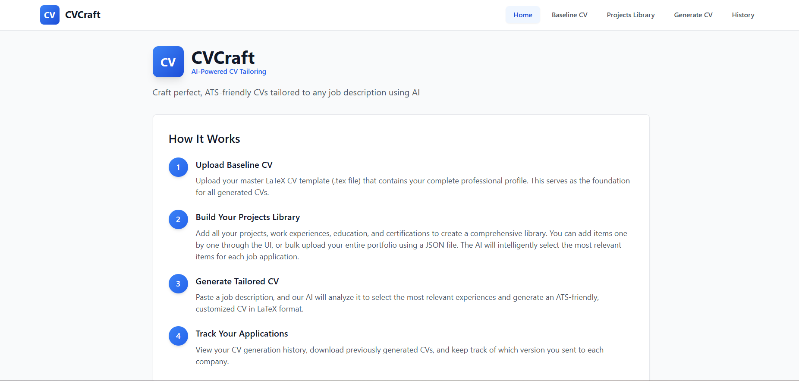
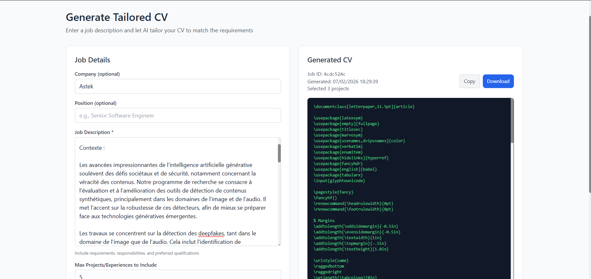
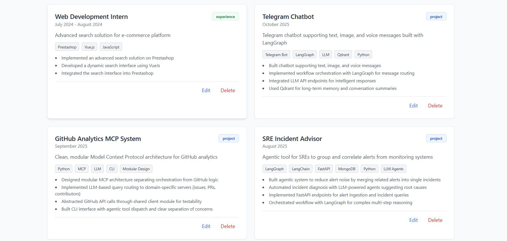

# CVCraft

A tool to centralize your CV content and generate tailored versions for different job applications using Gemini.

## Problem

When applying to jobs, you need to:
- Edit your CV manually for each application
- Decide which projects to include
- Keep track of multiple CV versions
- Remember all your past projects and achievements

## Solution

CVCraft stores all your projects, experiences, and achievements in one place. When you apply for a job, paste the job description and the LLM selects the most relevant items to generate a customized CV, you can also customise your requests, improve the prompt from the ui.

## Screenshots


*Home page with instructions*


*Generate tailored CV for a job posting*


*Manage all your projects and experiences*


*View and download previous CVs*

## Requirements

- Python 3.9+
- Node.js 18+
- Gemini API key (get one at https://makersuite.google.com/app/apikey)

## Setup

### Backend

```bash
cd backend
python -m venv venv
venv\Scripts\activate  # On Windows
source venv/bin/activate  # On Mac/Linux
pip install -r requirements.txt
```

Create a `.env` file in the backend folder:
```
GEMINI_API_KEY=your_key_here
GEMINI_MODEL=gemini-2.0-flash-exp
```

Start the server:
```bash
python main.py
```

### Frontend

```bash
cd frontend
npm install
echo "VITE_API_URL=http://localhost:8000" > .env
npm run dev
```

Open http://localhost:5173

## How to Use

1. Upload your LaTeX CV template (data is automatically extracted)
2. Optionally add more items or import your portfolio JSON
3. When applying for a job:
   - Paste the job description
   - Add custom instructions if needed
   - Click Generate
   - Download the tailored LaTeX CV

## Features

- **Auto-extraction**: Upload your CV once and the AI extracts all data automatically
- **Smart deduplication**: Import from multiple sources without creating duplicates
- **Intelligent selection**: AI picks the most relevant items for each job
- **Custom prompts**: Fine-tune generation with your own instructions
- **History tracking**: Keep track of all generated CVs

## Data Format

### Single Project
```json
{
  "title": "Project Name",
  "description": "Brief description",
  "technologies": ["React", "Python", "AWS"],
  "date_range": "Jan 2023 - Mar 2023",
  "category": "project",
  "bullets": [
    "Built feature X",
    "Improved performance by 40%"
  ]
}
```

### Bulk Import
You can import all your data at once. See the full format in the app's Home page or check `data/user_data_template.json`.

## Tech Stack

- Backend: Python, FastAPI
- Frontend: React, Vite, Tailwind CSS
- AI: Google Gemini API
- Storage: Local JSON files

## File Structure

```
CVmaker/
├── backend/
│   ├── main.py           # API server
│   ├── gemini_service.py # AI integration
│   └── data_manager.py   # Data storage
├── frontend/
│   └── src/
│       └── components/   # React UI
└── data/
    ├── baseline_cv.tex   # Your CV template
    ├── projects.json     # Your data
    └── generated/        # Generated CVs
```

## License

MIT
